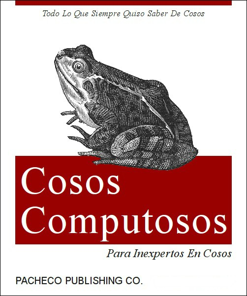

## Bienvenidos al repositorio del curso. Aquí encontrarás todo lo relevante al Seminario de Estadística.

### El salón del curso es 101 lunes, miercoles y viernes. Taller de finanzas Martes y Jueves

1. Subí Temario
2. Subí la Presentación
3. Hay un pequeño manual de github de instalación y también para anaconda, para los diferentes sistemas operativos LINUX/UNIX/WINDOWS.
4. Mañana jueves es con profesor y es importante su asistencia, ya que veremos tres problemas fundamentales del aprendizaje estadístico.
5 Subí dataframes que deberá de bajar y una carpeta de con manual de python
5. Al rato a las 10 haremos la instalación de los ambientes y configuración. Por favor bajar los archivos 
https://drive.google.com/open?id=1v7HAcT5N59GXjQ-5xg1cBVa6hZvrrYN1
6. Link de descarga
https://www.arangodb.com/download-major/  
y escoger NSIS packages- Server 3.5.0

